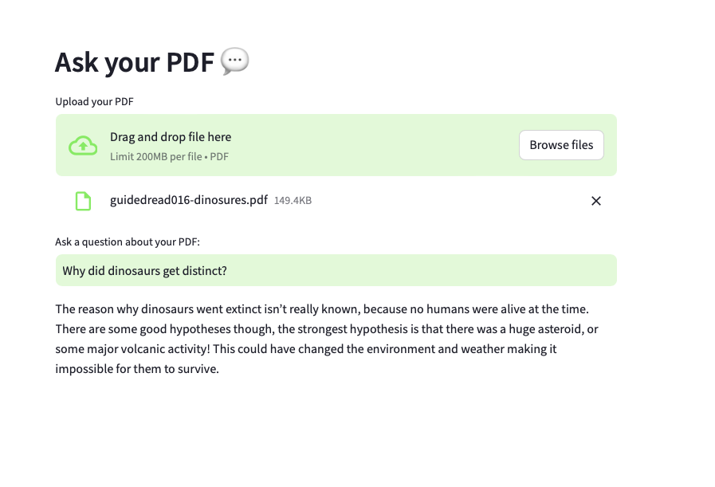

# Ask Your PDF 💬

Ask Your PDF is a web application that allows users to upload a PDF file and ask questions about its content. The application uses LangChain and OpenAI's GPT-3.5-turbo to extract relevant information from the PDF and provide answers to user queries.



## Features

- Upload any PDF file and ask questions about its content.
- Extracts text from the PDF and uses AI to answer questions.
- Displays relevant citations from the PDF.

## Installation

To get started with the project, follow these steps:

1. **Clone the repository:**

```sh
git clone https://github.com/mmaryam2020/talk-with-pdf.git
cd ask-your-pdf
```

2. **Create a virtual environment and activate it:**

```sh
python3 -m venv venv
source venv/bin/activate  # On Windows use `venv\Scripts\activate`
```

3. **Install the required dependencies:**

```sh
pip install -r requirements.txt
```

4. **Set up your OpenAI API key:**

Create a `.env` file in the root directory of the project and add your OpenAI API key:

```plaintext
OPENAI_API_KEY=your-openai-api-key
```

## Usage

To run the application, use the following command:

```sh
streamlit run app.py
```

This will start a local web server. Open the provided URL in your web browser to use the application.


## Acknowledgements

- LangChain
- OpenAI
- Streamlit
- PyPDF2
